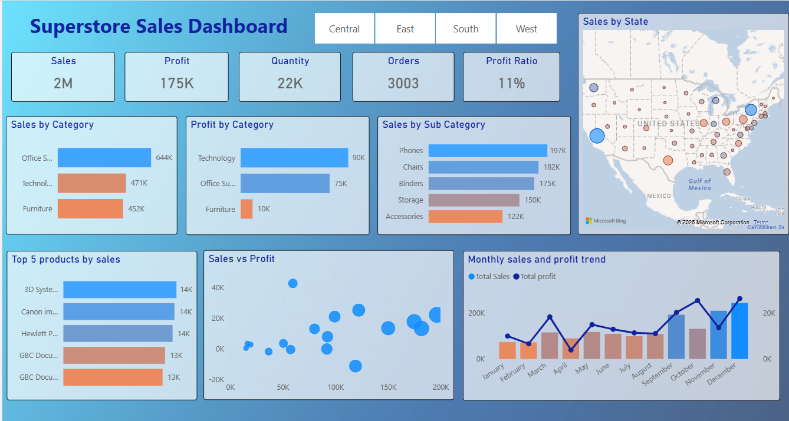

# Superstore Sales dashboard- PowerBI

## Project Overview
This project presents a sales analytics dashboard built using Microsoft Power BI to analyze the performance of a retail superstore dataset. The dashboard provides insights into sales, profit, product performance, and regional trends to support data-driven decision making.

## Key Performance Indicators (KPIs)
The dashboard tracks five core metrics at a glance:
* **Total Sales**
* **Total Profit**
* **Total Orders**
* **Total Quantity**
* **Profit Ratio**

## Visualisations
* Sales/Profit by Category: A breakdown showing that while **Office Supplies** leads in sales, **Technology** is the primary driver of profit.
* Sales vs Profit Scatter plot: Used to identify products with high sales but negative or low profit margins.
* Monthly Trend (Combo chart): A dual-axis chart comparing monthly sales volume against profit lines to visualize seasonality.
* Sales by State (Map visualisation): Displays geographic distribution of sales across different states.
* Top 5 products by Sales: A list of the highest revenue-generating items.

## Dashboard Preview

## Business Insights
* The **Furniture** category has high sales (452K) but significantly lower profit margins (10K). This suggests high overhead or aggressive discounting that needs review.
* **Phones** and **Chairs** are the leading revenue-generating sub-categories.
* States like **New york, Washington, California** generate high revenue while also making high profits, whereas states such as **Texas** and **Pennsylvania** generate strong sales but result in negative profit, indicating potential issues with high costs, heavy discounting, or inefficient operations in those regions.
* There is a massive spike in both sales and profit starting in **September**, peaking in **December**, suggesting strong seasonal demand during the holiday period.
* The scatter plot reveals that the **Tables** sub-category generates relatively high sales (around 100–150K) but results in negative profit, indicating low margins or high associated costs.
